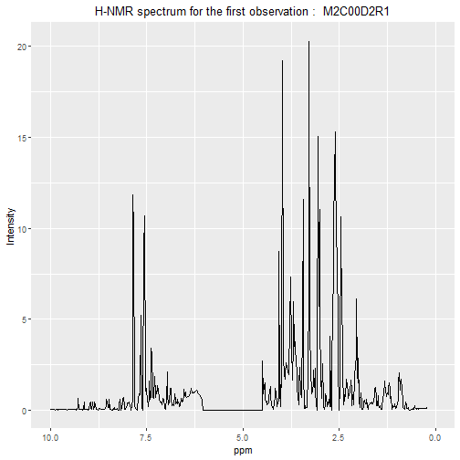
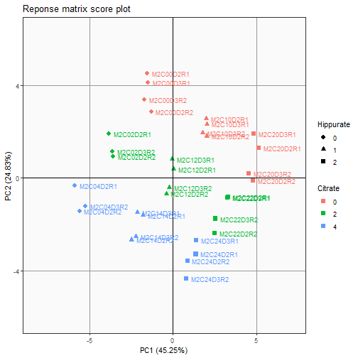
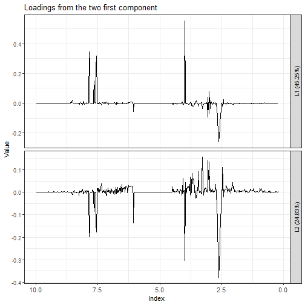

# Introduction

The main aim of this vignette is to give a brief example of the LMWiRe package. This package has been created to analyze models with wide response and categorical parameters. This example present all the usual step of the analysis starting from the data importation to the result visualisation. 

# Installation

The package is actually in its developping stage and is available on GitHub at the url : <https://github.com/FranceschiniS/LMWiRe>.It can be installed via the `devtools::install_github()` function. The pacakage needs to be loaded afterwards.


```r
# devtools::install_github("FranceschiniS/LMWiRe")

library("LMWiRe")
```

# Data importation

Before any analysis the `UCH data` needs to be loaded. The LMWiRe package contains the dataset and it can be load with the `data()` function. The `load()` function is also useful to import your own data.


```r
data("UCH")
```

# Data visualisation

The UCH dataset stands for Urine-Citrate-Hippurate and comes from \textit{Rousseau et al.} It contains 3 elements : a matrix `outcomes` with 34 observations of 600 response variables representing the spectra from the H-NMR spectroscopy, a formula for the GLM model used and `design` matrix with 34 observations and 5 explanatory variables. It is a good habit to start by a data visualisation.

First the 600 response variables are the spectrum of the H-NMR for each observations. They can be plot together with the simple `geom_line` function from the `ggplot2` package.


```r
firstobslab = names(UCH$outcomes[,1])[1]

ggplot2::ggplot(data = as.data.frame(t(UCH$outcomes))) + 
  ggplot2::geom_line(ggplot2::aes(x = as.numeric(colnames(UCH$outcomes)), y = UCH$outcomes[1, ])) +
  ggplot2::scale_x_reverse(lim = c(10, 0)) +
  ggplot2::xlab("ppm") +
  ggplot2::ylab("Intensity")+
  ggplot2::ggtitle(paste("H-NMR spectrum for the first observation : ",firstobslab))+
  ggplot2::theme(plot.title = ggplot2::element_text(hjust = 0.5))
```



Secondly the experimental design can be plotted. The function `PlotDesign` plot a graph of the experimental design for 3 differents variables. For more variables a scatterplot is necessary.


```r
PlotDesign(design = UCH$design, var1_name = "Citrate",var2_name = "Hippurate",var3_name = "Day")
```


# PCA (utile?)

The function `SVDforPCA` is useful to compute a PCA decomposition of the `outcomes` matrix. The `scores` and `loadings` can then be plotted with the function `DrawScores` and `DrawLoadings`.


```r
ResPCA = SVDforPCA(UCH$outcomes)
```


```r
eig.res = rbind(ResPCA$var[1:6], ResPCA$cumvar[1:6])
rownames(eig.res) = c("Variances", "Cum Var Values")
pander::pander(eig.res)
```


---------------------------------------------------------------------
       &nbsp;          PC1     PC2     PC3     PC4     PC5     PC6   
-------------------- ------- ------- ------- ------- ------- --------
   **Variances**      45.25   24.83   16.75   6.716   3.412   0.9151 

 **Cum Var Values**   45.25   70.08   86.82   93.54   96.95   97.87  
---------------------------------------------------------------------

```r
pander::pander("A scree plot should be perform")
```

A scree plot should be perform


```r
DrawScores(ResPCA, type.obj = "PCA", drawNames = TRUE, createWindow = F, 
    main = "Reponse matrix score plot", color = UCH$design$Citrate, pch = UCH$design$Hippurate, 
    axes = c(1, 2), size = 2.5) + ggplot2::scale_color_discrete(name = "Citrate") + ggplot2::scale_shape_discrete(name = "Hippurate")
```

```
## Scale for 'colour' is already present. Adding another scale for
## 'colour', which will replace the existing scale.
```

```
## Scale for 'shape' is already present. Adding another scale for 'shape',
## which will replace the existing scale.
```




```r
DrawLoadings(ResPCA,type.obj = "PCA", main="Loadings from the two first component")
```

```
## [[1]]
```



# GLM decomposition

The ASCA method consists of decomposing the model matrix into effect matrices and realize a PCA on each of the effect matrices. So we have 34 observations, 5 categorical explanatory variables also called parameters, 600 response variables and 8 model terms. From the formula :


```r
pander::pander(UCH$formula)
```

outcomes ~ Hippurate + Citrate + Time + Hippurate*Citrate+Time*Hippurate+Time*Citrate+Hippurate*Citrate*Time

The first step is to make the model matrix from the matrix of the experimental design. For every parameters we have k-1 coefficients with k being the number of level of the parameter. The model matrix is a 34xK with K being the total number of coefficients.


```r
ResLMModelMatrix = LMModelMatrix(as.formula(UCH$formula),UCH$design)
```

The model matrix can then be decompose into effect matrices for every model terms.


```r
ResLMEffectMatrices = LMEffectMatrices(ResLMModelMatrix,UCH$outcomes)
```


This can be shown with the `PlotLMSS` function.


